# tp-final-distribuidos

## Diseño inicial

En una idea inicial, podemos presentar 2 casos de entrada posibles: 

1- Un único gateway de entrada al sistema a través del cual todos los clientes realizan sus pedidos, este gateway distibuye cargas a partir de este gateway en diferentes nodos que comenzaran a realizar diferentes pedidos. 

2- Varios gateways, cada uno conectado a diferentes nodos luego, para que no se mezclen informaciones correspondientes a diferentes clientes. Esto podría solucionarse (igual a trabajos previos) con un id asociado a cada cliente, y compartir instancias de diferentes actividades. 

### Caso 1 de entrada al sistema

#### Ventajas

Con un único gateway vamos a tener simplicidad a la hora de manejar a los clientes. Toda la información del sistema ingresa por un único punto de entrada, por lo que es fácil de comprender y seguir el flujo del request de un cliente en su comienzo. 

A su vez, no hay que coordinar entre gateways o instancias porque toda la información volvería al mismo gateway para enviar al cliente el resultado de su request.

#### Desventajas

Principalmente, la simplicidad nos trae como problema un Unico Punto de Falla (SPOF). Esto no nos generaría un sistema un poco frágil en busqueda de ganar simplicidad, y lo haría poco escalable a su vez. 

### Caso 2 de entrada al sistema 

#### Ventajas

Un sistema que escala mejor ante mayor cantidad de requests de clientes, la distribución de cargas puede soportarse mejor, y ante fallas en un gateway, otro puede tomar temporalmente los requests del caído hasta que vuelva (a debatir).

#### Desventajas

El sistema va a tener mayor complejidad en el manejo de información. 

#### Posible solución

Podemos intentar manejar unicamente información en este gateway (de entrada y de salida) y entonces no tendríamos problemas a la hora de saber a quien envíar información o si esta se encuentra completa o no. El gateway recibe un mensaje a enviar a un cliente con información y simplemente la envía. Al ser stateless, podemos escalar con mayor cantidad de instancias de esta entidad Gateway de ser necesario sin presentarnos problemas.

### Decisión final

Vamos a usar gateways stateless que puedan recibir información de cualquier cliente y enviar información a cualquier cliente. La idea de no tener estado es que sean lo más escalables posibles. Si no tenemos un estado, podemos escalar de la forma más simple posible. 
La idea de escalar es no perder disponibilidad en ningún momento. En contraposición, vamos a tener una complejidad mayor en el procesamiento de los datos, porque pueden llegar de cualquier gateway y no hay una información compartida entre ellos y la parte del sistema que se encarga de procesar la información.

> **Agrego (Mateo):** Podemos hacer que, como parte del protocolo, el cliente deba pedir una IP a un nodo y que este balancee entre los diferentes gateways.

# Diagrama: Punto de entrada y salida del sistema

## ida: recibir request de un cliente

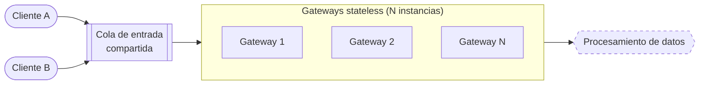

## vuelta: enviar resultados a medida que van llegando

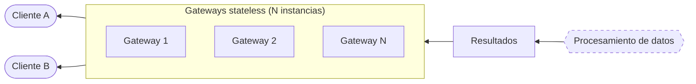

Aca se muestra una primera idea de como se vería el sistema de entrada del sistema. Si bien se muestran 2 clientes A y B, esto obviamente escalaría a N clientes que deseen utilizar el sistema.

> **Agrego (Mateo):** Así quedarían la ida y la vuelta si el cliente primero le pide una IP a un nodo balanceador y después se conecta directo al gateway que le asignaron.

### ida (con nodo balanceador)

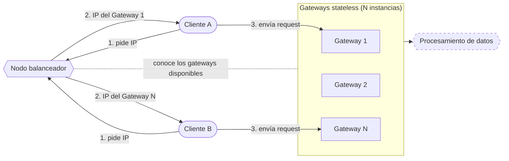

### vuelta (con nodo balanceador)

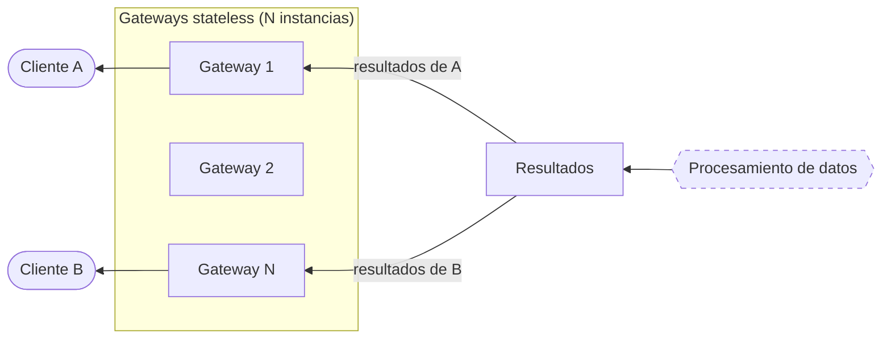

El balanceador solo interviene al principio para asignar un gateway. Después, el cliente habla directamente con ese gateway, tanto para enviar su request como para recibir los resultados.
Los flujos de procesamiento de cada consulta se describen en la sección siguiente.

# Requisitos Funcionales

El cliente establece una conexion con el servicio y empieza a leer el archivo por batches. El archivo es Parquet y no entra entero en memoria, así que lo lee de a partes. Cada batch tiene un conjunto de artículos enteros, y de cada artículo lleva solo las 6 columnas que usan las consultas: `name`, `url`, `date_modified`, `abstract`, `sections` e `image.content_url`. El cliente va agregando artículos al batch hasta llegar a un tope de N artículos o X KB, lo que pase primero. Un artículo nunca se parte entre dos batches: si no entra, se cierra el batch y el artículo empieza el siguiente. Si un artículo solo ya pesa más que X, va solo en su batch (ver "Tamaño de los artículos"). 
La lectura del archivo y la formación de los batches de entrada son responsabilidad del cliente.

> **Agrego (Mateo):** Esto también podría resolverse dentro del sistema. Las dos opciones están en el apartado "Responsabilidad de leer el archivo y armar los batches", más abajo.

El sistema tiene que responder las 5 consultas a la vez sobre el mismo archivo. El gateway reenvía cada batch que recibe a los clasificadores, que lo reparten entre las 5 consultas (ver "Filtrado de entrada"), y cada flujo procesa los datos en paralelo. Cada resultado indica a qué consulta corresponde, y el cliente los va recibiendo a medida que cada consulta termina.

Se detectan las siguientes entidades de computo independientes entre si:

## Filter 
Será el grupo de nodos encargados de: 
* Recibir batches de rows crudas.
* Aplicar el filtro (requerido por la consulta) sobre las filas recibidas.
* Eliminar las columnas innecesarias.
* Direccionar el resultante a la queue correcta.

## Text Processor
Será el grupo de nodos encargados de:
* Recibir batches de rows filtradas.
* Filtrar Stop Words.
* Construir Set Parciales de palabras unicas.
* Construir Sumas Parciales de palabras totales.

## Aggregator
Será el grupo de nodos encargados de:
* Unificar Set Parciales
* Unificar Sumas Parciales

## Joinner
Será el grupo de nodos encargados de:
* Unificar los resultados los procesamientos para entregar al Gateway el resultado final
* Buscar las fotos en caso necesario

## Responsabilidad de leer el archivo y armar los batches

> **Agrego (Mateo):** Hay dos formas de repartir esta responsabilidad. Falta decidir cuál usamos.

### Opción 1: la responsabilidad es del cliente

Es lo que se describe al principio de esta sección. El cliente lee el archivo, agrupa las filas crudas en batches y se los manda al gateway. El gateway solo reenvía esos batches a las queues de las 5 consultas.

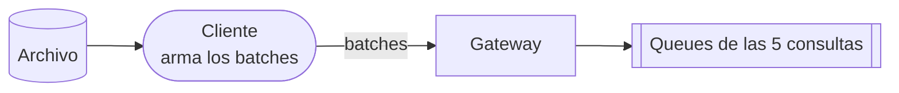

#### Ventajas

* El sistema es más simple: recibe los datos ya agrupados y no necesita saber nada del archivo.
* La lectura se reparte sola, porque cada cliente lee su propio archivo.

#### Desventajas

* El ritmo de entrada depende del cliente. Si lee lento, el sistema queda esperando.
* Cada cliente tiene que respetar el formato y el tamaño de batch que define el protocolo.

### Opción 2: la responsabilidad está dentro del sistema

El cliente solo se conecta al gateway y pide que se procese el dataset. La lectura la hacen varios searchers dentro del sistema: cada uno obtiene una parte de los artículos con la librería del dataset de Kaggle, la deja en un batch y lo manda a la queue. Los datos no pasan por el cliente ni por el gateway.

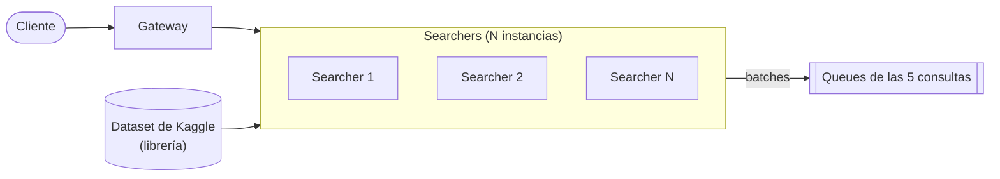

#### Ventajas

* El cliente es más liviano: no lee el archivo ni arma batches.
* Los artículos no viajan del cliente al sistema, porque los searchers los obtienen directo de la librería.
* El sistema controla el tamaño de los batches y el ritmo de lectura.
* La lectura escala agregando searchers.

#### Desventajas

* El sistema depende de la librería y del servicio externo para obtener los datos. Además, el enunciado pide que el cuerpo docente apruebe el uso de cualquier biblioteca.
* Hay que coordinar a los searchers para que no lean dos veces la misma parte, y para saber cuándo terminaron todos y cerrar las consultas.

# Filtrado de entrada

> **Agrego (Mateo):** Propuesta para el tramo que va desde que un batch entra al gateway hasta que se reparte entre las consultas. La idea es filtrar y recortar los datos lo antes posible, para no mandar de más.

## Dataset

Usamos el dataset [Wikipedia Structured Contents](https://www.kaggle.com/datasets/wikimedia-foundation/wikipedia-structured-contents) de Kaggle:

* Tiene solo artículos en inglés (7.597.149) y en francés (2.871.732). Todo artículo es de uno de los dos idiomas, así que el idioma no se filtra: es una etiqueta que se lee de la url (`en.wikipedia` o `fr.wikipedia`).
* Viene en Parquet, partido en 112 shards, y pesa 44,42 GiB en total.
* Las consultas solo usan 6 columnas: `name`, `url`, `date_modified`, `abstract`, `sections` e `image.content_url`. Las más pesadas (`tables`, `references`, `infoboxes`) no las usa ninguna.

### Tamaño de los artículos

Medimos cuánto pesa cada artículo para saber si alguno puede no entrar en un mensaje. RabbitMQ 4.x acepta por defecto mensajes de hasta 16 MiB.

Wikimedia publica el mismo dataset en [Hugging Face](https://huggingface.co/datasets/wikimedia/structured-wikipedia), con estadísticas por columna. Esas estadísticas salen de una muestra de unos 554.000 artículos por idioma, y estos son los largos en bytes:

| Columna | Inglés: media | Inglés: máximo | Francés: media | Francés: máximo |
|---|---|---|---|---|
| `abstract` | 371 | 32.683 | 276 | 20.328 |
| `sections` | 4.122 | 845.564 | 4.852 | 1.048.777 |
| `name` | 20 | 167 | 19 | 188 |
| `url` | 51 | 197 | 51 | 266 |

Como la muestra no incluye todo el dataset, también medimos los artículos más largos de cada Wikipedia, según la página "Longpages" de cada una. Tienen como máximo 900 KB de wikitext, y su HTML completo pesa como máximo 5 MB. El HTML es una cota superior, porque `sections` se arma a partir del HTML y pesa mucho menos.

Conclusiones:

* Ningún artículo debería acercarse a los 16 MiB. El peor caso está en el orden de 1 a 5 MB, así que no hace falta partir artículos.
* Un artículo promedio, con las 6 columnas, pesa unos 5 KB, y casi todo es `sections`. Por ejemplo, un batch de 1 MB lleva unos 200 artículos.
* Con las 6 columnas sin comprimir, entran al sistema unos 50 GB en total, casi lo mismo que pesa el dataset completo comprimido.

### Fechas

El enunciado filtra por artículos "escritos" hasta 2020, y el dataset tiene dos fechas: `date_created` y `date_modified`. Contamos las dos sobre el dataset completo:

| | Inglés | Francés | Total |
|---|---|---|---|
| Artículos | 7.597.149 | 2.871.732 | 10.468.881 |
| `date_created` con valor | 6.154.901 (81 %) | 1.768.141 (62 %) | 7.923.042 (76 %) |
| `date_created` vacío | 1.442.248 (19 %) | 1.103.591 (38 %) | 2.545.839 (24 %) |
| Hasta 2020 según `date_modified` | 140.724 (1,9 %) | 176.112 (6,1 %) | 316.836 (3 %) |
| Hasta 2020 según `date_created` | 5.109.778 (67 %) | 1.387.372 (48 %) | 6.497.150 (62 %) |

* "Escrito" corresponde a la fecha de creación. Además, Q1 pide la fecha de modificación como dato de salida, así que el enunciado trata a las dos fechas como cosas distintas.
* Con `date_modified`, un artículo escrito en 2005 y editado el mes pasado cuenta como de 2026. Así, Q1, Q2 y el promedio de Q5 trabajarían solo sobre el 3 % de los artículos.
* En ningún artículo la creación es posterior a la modificación. Por eso, si `date_modified` es de 2020 o antes, el artículo seguro se escribió hasta 2020, aunque no tenga `date_created`.

Con esa regla, los artículos quedan así:

| | Inglés | Francés | Total |
|---|---|---|---|
| Hasta 2020 seguro | 5.250.494 (69 %) | 1.563.482 (54 %) | 6.813.976 (65 %) |
| Desde 2021 seguro | 1.045.123 (14 %) | 380.769 (13 %) | 1.425.892 (14 %) |
| No se sabe (sin `date_created` y modificados desde 2021) | 1.301.532 (17 %) | 927.481 (32 %) | 2.229.013 (21 %) |

Pendiente: qué hacer con el 21 % que no se sabe. Lo estamos cruzando con el `identifier` de cada artículo, que crece con el tiempo, para ver si los que no tienen `date_created` son artículos viejos. Si usamos `date_created`, el cliente pasa a leer 7 columnas.

## Del gateway al exchange de entrada

1. **Lectura.** Quien lee el archivo (el cliente en la opción 1, los searchers en la opción 2) carga solo las columnas que se usan y arma los batches.
2. **Gateway.** Le agrega al batch el `client_id` y el `gateway_id` y lo deja en la cola de clasificación. No mira el contenido. Todos los mensajes que siguen llevan esos dos datos, así que no los repetimos en los diagramas.
3. **Clasificador (sin estado, N instancias).** Toma batches de la cola de clasificación, que es compartida: cada batch lo toma una sola instancia. Para cada artículo calcula el período (`hasta_2020` o `desde_2021`, según la fecha que definamos en "Fechas") y el idioma.
4. **Exchange de entrada (direct).** El clasificador arma un mensaje por tipo, con solo las columnas que necesita cada grupo, y lo publica con el tipo como clave:

    | Clave | Columnas | Se publica para | Cola |
    |---|---|---|---|
    | `meta` | url, date_modified | hasta 2020, inglés | Cola de resultados (Q1) |
    | `bio` | name, url, sections, image_url | hasta 2020 | Cola bio (Q2) |
    | `texto` | url, abstract, período, idioma | todos | Cola texto (Q3, Q4 y Q5) |

    El clasificador vuelve a agrupar los artículos por clave, así que cada mensaje que publica es un batch con una sola clave. Solo publica lo que alguien consume: por ejemplo, un artículo en francés de 2023 solo sale como `texto`.

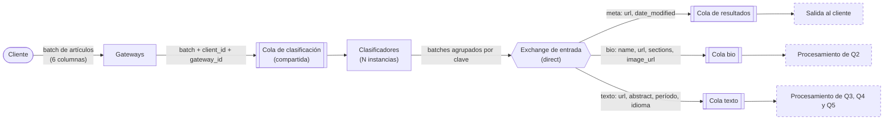

Los nodos punteados agrupan partes del sistema que se explican en otra sección.

Ningún nodo le manda mensajes directamente a otro. Todos los exchanges son direct: cada nodo publica con una clave, y cada cola se conecta a las claves que le interesan. Con direct alcanzan dos formas de conectar las colas:

* **Repartir trabajo:** las instancias de un grupo leen de una cola compartida, y cada mensaje lo toma una sola. Por ejemplo, la cola texto.
* **Avisar a todos (broadcast):** cada instancia tiene su propia cola, y todas se conectan con la misma clave. Así, cada una recibe una copia del mensaje. Por ejemplo, el promedio de Q5, que les llega a todos los comparadores.

No usamos exchanges topic ni fanout. Topic serviría para que cada cola elija con un patrón qué mensajes quiere, pero el clasificador ya decide qué publica y para quién. Fanout serviría para avisar a todos, y eso ya se resuelve conectando varias colas con la misma clave. Con un solo tipo de exchange, el middleware queda más simple.

# Procesamiento de las consultas

> **Agrego (Mateo):** Propuesta para cada consulta, desde que sale del exchange de entrada hasta que llega a la cola de resultados. En cada diagrama, las otras consultas se agrupan en un solo nodo punteado.

## Q1

1. El clasificador publica `meta` solo para los artículos en inglés hasta 2020, con url y `date_modified`. Eso ya es la respuesta de Q1.
2. El exchange de entrada lo deja directo en la cola de resultados. Q1 no necesita ningún nodo más.

Los resultados de Q1 salen a medida que se clasifican los batches. No hace falta esperar al final del archivo.

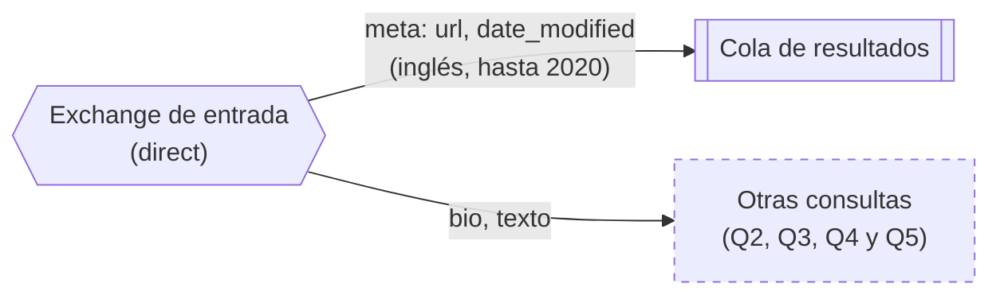

## Q2

A la cola bio solo llegan artículos hasta 2020, con name, url, sections e image_url. Q2 se resuelve en dos etapas separadas, porque tienen cargas distintas: la primera usa sobre todo CPU y la segunda pasa casi todo el tiempo esperando a la red. Así, cada una escala por su lado.

**Filter biography (sin estado, N instancias)**

1. Toma un batch de la cola bio, que es compartida.
2. Busca "biography" o "biographie" en `sections`, sin distinguir mayúsculas. Busca las dos palabras en todos los artículos, sin importar el idioma: un artículo en inglés que dice "biographie" también pasa. Alcanza con que la palabra aparezca en cualquier parte de las secciones, ya sea como título o mencionada en el texto.
3. Como alcanza con que la palabra aparezca, no hace falta parsear el JSON: se busca directo sobre el string. Es mucho más barato que hacer `json.loads` de cada artículo. Lo único que hay que tener en cuenta es que también encuentra la palabra dentro de un link (por ejemplo, una url a `.../wiki/Biography`), que en general está acompañado de un texto que la menciona.
4. Descarta `sections`, que ya no hace falta, y publica name, url e image_url en la cola imágenes.

**Buscador de imágenes (sin estado, N instancias)**

1. Toma un batch de la cola imágenes, que es compartida.
2. Baja la imagen de cada artículo desde `image_url`, que apunta a `upload.wikimedia.org`. Cada instancia hace varias descargas en paralelo, porque casi todo el tiempo está esperando la respuesta.
3. Si una descarga falla o Wikimedia responde que hay demasiados pedidos, la reintenta esperando cada vez un poco más. Además, cada pedido tiene que llevar un User-Agent que identifique al sistema, con un nombre y un mail de contacto (por ejemplo, `tp-distribuidos/1.0 (mail@fi.uba.ar)`). Wikimedia lo exige y suele bloquear los pedidos que llegan con el User-Agent por defecto de las librerías.
4. Publica en la cola de resultados name, url y los bytes de la imagen. Si el artículo no tiene imagen, o la descarga falla después de los reintentos, publica el resultado sin bytes.

Los resultados de Q2 salen a medida que se procesan. No hace falta esperar al final del archivo.

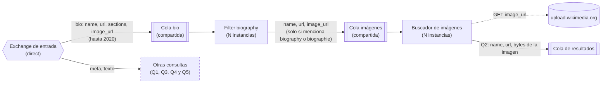

## Del exchange de entrada al exchange de palabras

Q3, Q4 y Q5 comparten la primera etapa, el Text processor, porque las tres cuentan las palabras de los abstracts. Asumimos que las tres excluyen las stopwords.

**Text processor (sin estado, N instancias)**

1. Toma un batch de la cola texto, que es compartida.
2. Para cada abstract, pasa el texto a minúsculas y lo separa en palabras. En francés también corta los apóstrofos: "l'homme" se separa en "l" y "homme".
3. Se queda con las palabras únicas del abstract y saca las stopwords, con la lista del idioma del artículo.
4. Cuenta las palabras que quedaron. Ese número es el que usa Q5, y las palabras son las que usan Q3 y Q4.
5. Antes de publicar, agrupa todo el batch. Para Q3 y Q4 no manda las palabras artículo por artículo: manda una entrada por palabra, con `palabra → (en cuántos artículos del batch aparece, si aparece en inglés, si aparece en francés)`. Así, una palabra frecuente viaja una vez por batch y no una vez por artículo.
6. Publica en el exchange de palabras:

    | Clave | Contenido | Cómo se reparte | La toma |
    |---|---|---|---|
    | `palabras.<i>` | las entradas de las palabras con `hash(palabra) mod N = i` | por hash de la palabra | Contador de palabras i (Q3 y Q4) |
    | `promedio.<k>` | suma y cantidad de palabras del batch, de los artículos hasta 2020 | por hash del cliente: `k = hash(client_id) mod M` | Promedio k (Q5) |
    | `comparacion` | url y cantidad de palabras de cada artículo desde 2021 | cola compartida | Comparador (Q5) |

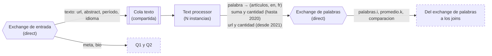

## Del exchange de palabras a los joins

Cada clave del exchange de palabras va a un tipo de nodo distinto, y cada uno se reparte de una forma distinta según lo que necesita:

* **`palabras.<i>` → Contador de palabras (por hash de la palabra).** Cada instancia tiene su propia cola y recibe solo las palabras de su shard. Así, todas las apariciones de una misma palabra caen en el mismo nodo, y ese nodo tiene su conteo completo. Una cola compartida no sirve acá, porque la misma palabra terminaría en instancias distintas.
* **`promedio.<k>` → Promedio (por hash del cliente).** Todos los conteos de un mismo cliente van a la misma instancia, que puede calcular el promedio de ese cliente sola.
* **`comparacion` → Comparador (cola compartida).** Cada artículo se compara solo, así que no importa qué instancia lo tome.

**Contador de palabras (con estado, N shards)**

Cada instancia guarda, por cliente y por palabra, `{en: sí/no, fr: sí/no, artículos: n}`. Con cada entrada que llega suma los artículos y marca los idiomas. Cuando terminaron los datos del cliente:

* **Para Q3:** publica las palabras que tienen `en` y `fr` marcados con la clave `join_q3.<j>`, donde `j = hash(client_id)` módulo la cantidad de instancias del Join Q3. Como puede ser una lista larga, la manda en batches, y al final manda un aviso de que ese shard terminó. Si no tiene palabras compartidas, manda solo el aviso.
* **Para Q4:** calcula su top 20 local y lo publica con la clave `top20.<t>`, calculada igual. Si no tiene palabras, publica un top vacío, así el Top 20 final sabe que ese shard terminó.

Después borra el estado de ese cliente.

**Promedio (con estado, repartido por cliente)**

Acumula la suma y la cantidad de palabras de los artículos hasta 2020 de cada cliente. Cuando terminaron los datos del cliente, calcula el promedio y lo publica en el exchange de promedios con la clave `promedio_final`. Todas las instancias del Comparador tienen una cola conectada con esa clave, así que es un broadcast: a cada una le llega su copia. Se explica en detalle en Q5.

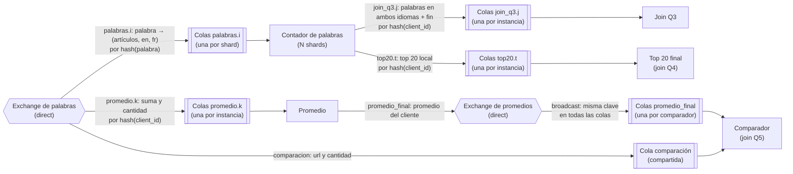

## Q3

1. El Text processor publica cada palabra en `palabras.<i>`, según su hash, con las marcas de idioma.
2. Cada Contador de palabras marca en qué idiomas aparece cada palabra de su shard. Cuando terminan los datos del cliente, publica las que aparecen en los dos idiomas en `join_q3.<j>`, y después el aviso de fin.
3. **Join Q3 (con estado, repartido por cliente).** A medida que recibe las listas de los shards, las reenvía a la cola de resultados. No tiene que cruzar ni ordenar nada: cada palabra está en un solo shard, así que la respuesta de Q3 es la unión de lo que mandan todos. Lo que agrega es saber cuándo terminó Q3: cuenta los avisos de fin del cliente, y cuando tiene los N, avisa una sola vez que Q3 terminó. Así el cliente no tiene que saber cuántos shards hay.

Q3 no compara artículos de a pares. Una palabra está en la respuesta si aparece en al menos un artículo en inglés y en al menos un artículo en francés, así que alcanza con la intersección de dos conjuntos: las palabras de todos los artículos en inglés y las de todos los artículos en francés. Cada artículo se mira una sola vez. El hash por palabra es lo que permite repartir esa intersección: las apariciones en inglés y en francés de una palabra llegan al mismo shard, y ese shard decide solo.

```mermaid
flowchart LR
    EXE{{"Exchange de entrada<br/>(direct)"}}
    EXE -- "texto: url, abstract, período, idioma" --> QTX[["Cola texto<br/>(compartida)"]]
    QTX --> TP["Text processor<br/>(N instancias)"]
    TP --> EXP{{"Exchange de palabras<br/>(direct)"}}
    EXP -- "palabras.i: palabra → (artículos, en, fr)<br/>por hash(palabra)" --> QW[["Colas palabras.i<br/>(una por shard)"]]
    QW --> WC["Contador de palabras<br/>(N shards)"]
    WC -- "join_q3.j: palabras en ambos idiomas + fin<br/>por hash(client_id)" --> QJ3[["Colas join_q3.j<br/>(una por instancia)"]]
    QJ3 --> J3["Join Q3"]
    J3 -- "Q3: palabras compartidas<br/>+ aviso de fin de Q3" --> QR[["Cola de resultados"]]

    EXE -- "meta, bio" --> OTRAS["Otras consultas<br/>(Q1, Q2, Q4 y Q5)"]
    EXP -- "promedio.k, comparacion" --> OTRAS
    WC -- "top20.t" --> OTRAS

    classDef resto stroke-dasharray: 5 5
    class OTRAS resto
```

## Q4

1. El Text processor publica cada palabra en `palabras.<i>`, según su hash, con la cantidad de artículos del batch en los que aparece.
2. Cada Contador de palabras suma, para cada palabra de su shard, en cuántos artículos aparece. Cuando terminan los datos del cliente, calcula su top 20 local y lo publica en `top20.<t>`.
3. **Top 20 final (con estado, repartido por cliente).** Recibe los N tops locales del cliente. Cuando tiene los N, ordena las N×20 palabras y publica las 20 primeras en la cola de resultados.

El resultado es exacto, porque cada palabra se contó entera en un solo shard. Si una palabra está en el top 20 global, la superan menos de 20 palabras en total, así que en su shard también la superan menos de 20. Por lo tanto, siempre aparece en el top 20 local de su shard. Esto no pasaría si cada nodo contara una parte de los artículos: ahí una palabra puede quedar afuera de todos los tops locales y aun así estar primera en el total.

**Empates:** si dos palabras empatan en el puesto 20, un shard podría mandar una y otro la otra, y el resultado cambiaría entre ejecuciones. Para evitarlo, los shards y el Top 20 final desempatan igual: a igual cantidad de artículos, va primero la palabra que viene antes en orden alfabético.

```mermaid
flowchart LR
    EXE{{"Exchange de entrada<br/>(direct)"}}
    EXE -- "texto: url, abstract, período, idioma" --> QTX[["Cola texto<br/>(compartida)"]]
    QTX --> TP["Text processor<br/>(N instancias)"]
    TP --> EXP{{"Exchange de palabras<br/>(direct)"}}
    EXP -- "palabras.i: palabra → (artículos, en, fr)<br/>por hash(palabra)" --> QW[["Colas palabras.i<br/>(una por shard)"]]
    QW --> WC["Contador de palabras<br/>(N shards)"]
    WC -- "top20.t: top 20 local<br/>por hash(client_id)" --> QTOP[["Colas top20.t<br/>(una por instancia)"]]
    QTOP --> TOP["Top 20 final"]
    TOP -- "Q4: 20 pares (palabra, cantidad)" --> QR[["Cola de resultados"]]

    EXE -- "meta, bio" --> OTRAS["Otras consultas<br/>(Q1, Q2, Q3 y Q5)"]
    EXP -- "promedio.k, comparacion" --> OTRAS
    WC -- "join_q3.j" --> OTRAS

    classDef resto stroke-dasharray: 5 5
    class OTRAS resto
```

## Q5

No se puede decidir ningún artículo desde 2021 hasta conocer el promedio, y el promedio necesita todos los artículos hasta 2020. Los artículos no vienen ordenados por fecha, así que el último de 2020 puede llegar al final del archivo. Por eso Q5 tiene dos lados que trabajan en paralelo y se encuentran en el Comparador.

### Lado del promedio

1. Para los artículos hasta 2020, el Text processor no manda cada artículo: manda la suma y la cantidad de palabras de su batch en `promedio.<k>`. No manda el promedio de cada batch, porque el promedio de promedios da mal. Con suma y cantidad, el resultado final es exacto.
2. **Promedio (con estado, repartido por cliente).** Acumula la suma y la cantidad de cada cliente. Es un mensaje chico por batch, así que la carga es mínima.
3. Cuando terminaron los datos del cliente, calcula `suma / cantidad` y lo publica en el exchange de promedios con la clave `promedio_final`. Le llega a todos los comparadores (broadcast).

### Lado de la comparación

1. Para los artículos desde 2021, el Text processor manda url y cantidad de palabras de cada uno en `comparacion`.
2. Las instancias del Comparador comparten esa cola, así que los artículos de un cliente se reparten entre ellas, y cada una guarda solo su parte.

### Join: Comparador (con estado, N instancias)

Cada instancia lee de dos colas: la cola compartida `comparacion` y su propia cola conectada con `promedio_final`.

1. Mientras no llegó el promedio del cliente, escribe `(url, cantidad)` de cada artículo que recibe al final de un archivo en disco, uno por cliente. Le hace ack al mensaje recién cuando lo escribió en el archivo.
2. Cuando llega el promedio, lee el archivo de punta a punta, publica en la cola de resultados los artículos que lo superan y borra el archivo.
3. Desde ese momento, compara cada artículo nuevo apenas llega, sin pasar por el disco.
4. Da por terminado al cliente cuando tiene el promedio y además terminaron sus datos.

Lo guarda en disco y no en memoria porque es lo que más espacio ocupa del sistema. Para un cliente que manda el dataset completo, son entre 1,4 y 3,6 millones de artículos desde 2021 (depende de qué hagamos con los que no tienen fecha de creación). En memoria, como tuplas de Python, serían entre 300 y 730 MB por cliente, y el consumo crecería con cada cliente simultáneo hasta que el nodo se quede sin memoria. En disco ocupan entre 80 y 200 MB por cliente, y la memoria que usa el Comparador queda fija sin importar cuántos clientes haya. Escribir y leer el archivo en orden es rápido, y no agrega una demora importante: Q5 igual no puede responder antes de que termine el archivo.

Los archivos se borran cuando el cliente termina. Si el nodo recibe un SIGTERM, cierra los archivos abiertos antes de salir.

```mermaid
flowchart LR
    EXE{{"Exchange de entrada<br/>(direct)"}}
    EXE -- "texto: url, abstract, período, idioma" --> QTX[["Cola texto<br/>(compartida)"]]
    QTX --> TP["Text processor<br/>(N instancias)"]
    TP --> EXP{{"Exchange de palabras<br/>(direct)"}}

    EXP -- "promedio.k: suma y cantidad (hasta 2020)<br/>por hash(client_id)" --> QAVG[["Colas promedio.k<br/>(una por instancia)"]]
    QAVG --> AVG["Promedio"]
    AVG -- "promedio_final: promedio del cliente" --> EXB{{"Exchange de promedios<br/>(direct)"}}
    EXB -- "broadcast: misma clave<br/>en todas las colas" --> QB[["Colas promedio_final<br/>(una por comparador)"]]
    QB --> CMP["Comparador<br/>(N instancias)"]

    EXP -- "comparacion: url y cantidad (desde 2021)" --> QCMP[["Cola comparación<br/>(compartida)"]]
    QCMP --> CMP
    CMP -. "guarda url y cantidad<br/>hasta que llega el promedio" .-> DISK[("Archivo por cliente<br/>(disco)")]
    CMP -- "Q5: url y cantidad<br/>(los que superan el promedio)" --> QR[["Cola de resultados"]]

    EXE -- "meta, bio" --> OTRAS["Otras consultas<br/>(Q1, Q2, Q3 y Q4)"]
    EXP -- "palabras.i" --> OTRAS

    classDef resto stroke-dasharray: 5 5
    class OTRAS resto
```

Los nodos con estado (Contador de palabras, Join Q3, Top 20 final, Promedio y Comparador) necesitan saber cuándo terminaron los datos de un cliente para poder emitir. Eso depende del mecanismo de EOF, que se describe aparte.

# Flujos Esperados
## 1. 
### Url y fecha de modificación para artículos escritos en inglés hasta 2020 inclusive.

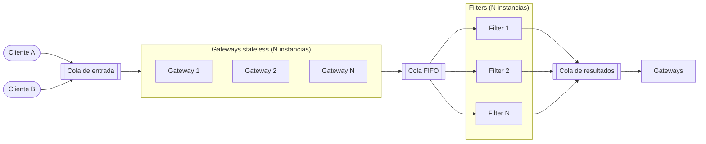

## 2. 
### Nombre, url e imágen (bytes) de artículos escritos hasta 2020 inclusive que incluyan “biography” o “biographie” entre sus secciones.

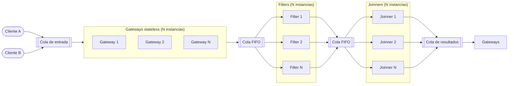