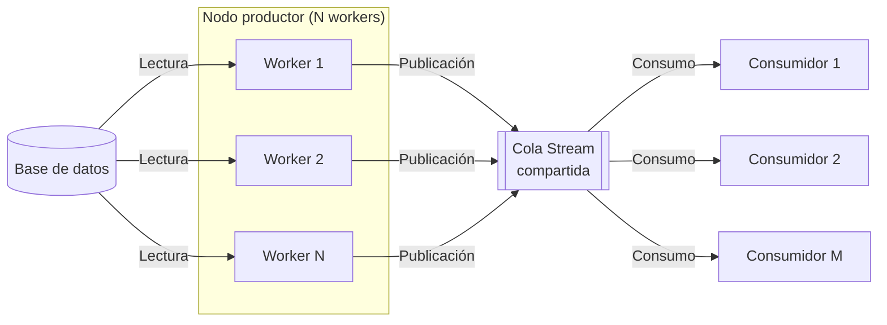

# tp-final-distribuidos

## Diseño inicial

En una idea inicial, podemos presentar 2 casos de entrada posibles: 

1- Un único gateway de entrada al sistema a través del cual todos los clientes realizan sus pedidos, este gateway distibuye cargas a partir de este gateway en diferentes nodos que comenzaran a realizar diferentes pedidos. 

2- Varios gateways, cada uno conectado a diferentes nodos luego, para que no se mezclen informaciones correspondientes a diferentes clientes. Esto podría solucionarse (igual a trabajos previos) con un id asociado a cada cliente, y compartir instancias de diferentes actividades. 

### Caso 1 de entrada al sistema

#### Ventajas

Con un único gateway vamos a tener simplicidad a la hora de manejar a los clientes. Toda la información del sistema ingresa por un único punto de entrada, por lo que es fácil de comprender y seguir el flujo del request de un cliente en su comienzo. 

A su vez, no hay que coordinar entre gateways o instancias porque toda la información volvería al mismo gateway para enviar al cliente el resultado de su request.

#### Desventajas

Principalmente, la simplicidad nos trae como problema un Unico Punto de Falla (SPOF). Esto no nos generaría un sistema un poco frágil en busqueda de ganar simplicidad, y lo haría poco escalable a su vez. 

### Caso 2 de entrada al sistema 

#### Ventajas

Un sistema que escala mejor ante mayor cantidad de requests de clientes, la distribución de cargas puede soportarse mejor, y ante fallas en un gateway, otro puede tomar temporalmente los requests del caído hasta que vuelva (a debatir).

#### Desventajas

El sistema va a tener mayor complejidad en el manejo de información. 

#### Posible solución

Podemos intentar manejar unicamente información en este gateway (de entrada y de salida) y entonces no tendríamos problemas a la hora de saber a quien envíar información o si esta se encuentra completa o no. El gateway recibe un mensaje a enviar a un cliente con información y simplemente la envía. Al ser stateless, podemos escalar con mayor cantidad de instancias de esta entidad Gateway de ser necesario sin presentarnos problemas.

### Decisión final

Vamos a usar gateways stateless que puedan recibir información de cualquier cliente y enviar información a cualquier cliente. La idea de no tener estado es que sean lo más escalables posibles. Si no tenemos un estado, podemos escalar de la forma más simple posible. 
La idea de escalar es no perder disponibilidad en ningún momento. En contraposición, vamos a tener una complejidad mayor en el procesamiento de los datos, porque pueden llegar de cualquier gateway y no hay una información compartida entre ellos y la parte del sistema que se encarga de procesar la información.

# Diagrama: Punto de entrada y salida del sistema

## ida: recibir request de un cliente

## vuelta: enviar resultados a medida que van llegando

Aca se muestra una primera idea de como se vería el sistema de entrada del sistema. Si bien se muestran 2 clientes A y B, esto obviamente escalaría a N clientes que deseen utilizar el sistema.
Al no tener una decisión tomada con respecto a como se verá el sistema con respecto a procesar esta información, de momento no se lo diagramó, esto es lo próximo a realizar.

# Requisitos Funcionales

## 1 - Url y fecha de modificación para artículos escritos en inglés hasta 2020 inclusive

El sistema debe soportar multiples clientes requiriendo esta informacion. 
La primer solucion que uno puede estar tentado de programar es crear un worker por cliente y manejar las conexiones en paralelo. Esta propuesta escala pobremente ante multiples clientes, haciendo lecturas innecesarias de memoria y stremeando informacion repetida.

Se propone un nodo con N workers, que se encargaran de leer la informacion, filtrar las columnas y registros necesarios y publicar la informacion en un RabbitMQ Stream

Todos los clientes podran subscribirse al stream, leer los mismos datos (que el productor solo tuvo que generar una vez en un dado tiempo X)

El unico drawback es que eventualmente el nodo deberia loopear y volver a leer/procesar la informacion para los clientes que lleguen despues de que el primer dato streameado muera en el Stream.

# Diagrama: Diseño del primer requisito funcional

Los workers de un mismo nodo leen en distintos puntos, aplican filtros y publican mensajes en una cola Stream compartida. Múltiples consumidores leen los mensajes de ese Stream.

