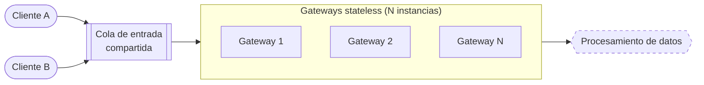
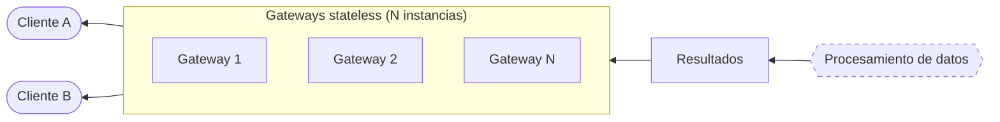

# Diagrama: Punto de entrada y salida del sistema

Cada cliente lee su archivo local y forma batches de filas crudas antes de enviarlos a la cola de entrada. Los gateways reciben esos batches y los publican hacia la cola de preparación. El procesamiento de cada consulta comienza en el pool de preparación y filtros, como se muestra en [Flujos de los requisitos funcionales](requisitos_funcionales.md).

## ida: recibir request de un cliente

## vuelta: enviar resultados a medida que van llegando

